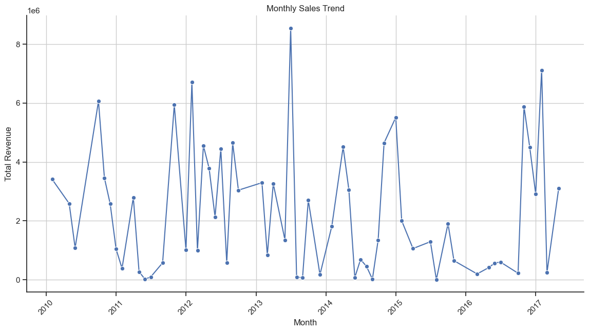

# Amazon Sales Analysis Project

## Overview 

In an era where competition is fierce and operational efficiency is paramount, businesses are increasingly turning to data-driven strategies to refine their sales management. This project explores Amazon sales data to uncover trends and key metrics that reveal the dynamics of sales performance over time. By employing the ETL (Extract-Transform-Load) process, we will systematically gather, clean, and analyze data to identify monthly and yearly sales trends. Additionally, the analysis will focus on finding meaningful relationships between various attributes to uncover the factors that influence sales outcomes. Through this project, we aim to provide actionable insights that can empower companies to optimize their sales strategies, reduce costs, and drive profitability in today’s challenging market.


## The Analysis

### 1. What are the monthly sales trends?

To answer the question, "What are the monthly sales trends?" I began by organizing the dataset to focus on sales figures by month. First, I converted the Order Date column into a datetime format, allowing me to extract a combined Year-Month value for each record. This transformation helped in aggregating data on a monthly basis, making it possible to track sales over time.

Using this new Year-Month column, I calculated the total monthly revenue by summing the Total Revenue values for each month. This provided a clear, month-by-month view of revenue trends, allowing me to observe how sales evolved over time.

I then visualized these monthly trends in a line plot, which illustrates the fluctuations in total revenue across different months. The line plot clearly shows periods of high and low sales, which could relate to seasonal demand, promotions, or other external factors impacting sales.

This analysis highlights key trends in Amazon’s sales performance on a monthly basis, providing insights that could guide future decisions on inventory management, marketing strategies, and resource allocation. By focusing on monthly sales patterns, the analysis helps identify any recurring peaks or declines, potentially uncovering factors that drive customer purchasing behavior.


## Visualize Data

``` python 


df = Data.copy()

# Ensure 'Order Date' is in datetime format
df['Order Date'] = pd.to_datetime(df['Order Date'])

# Extract year and month from 'Order Date'
df['Year-Month'] = df['Order Date'].dt.to_period('M')

# Calculate monthly sales
monthly_sales = df.groupby('Year-Month')['Total Revenue'].sum().reset_index()

# Convert 'Year-Month' back to datetime for plotting
monthly_sales['Year-Month'] = monthly_sales['Year-Month'].dt.to_timestamp()

# Set the plot style and plot the data
sns.set(style="whitegrid")
sns.set_theme(style='ticks')
plt.figure(figsize=(14, 7))
sns.lineplot(data=monthly_sales, x='Year-Month', y='Total Revenue', marker='o', color='b')

# Customizing the plot
sns.despine()
plt.title("Monthly Sales Trend")
plt.xlabel("Month")
plt.ylabel("Total Revenue")
plt.xticks(rotation=45)
plt.grid(True)
plt.show()


```


## Results




## Insights

1. Sales Fluctuations: The monthly sales data reveals significant fluctuations over the years, with some months showing sharp peaks followed by steep declines. This indicates irregular sales patterns, possibly influenced by seasonal factors, promotions, or external events.

2. Peak Revenue Periods: Certain months, particularly in years like 2012, 2013, and 2017, experienced exceptionally high sales revenue. Identifying these peak periods could help in understanding what drives high revenue (e.g., holiday season, promotional campaigns) and in replicating these strategies in future months.

3. Consistent Low Points: Some months consistently exhibit lower revenue figures, such as early 2013 and 2014. This trend could indicate a recurring dip in customer demand during specific times of the year, which might be useful for inventory and marketing planning.

4. Recent Increase: The data toward the end of the time series (2017) shows a strong upward trend after a period of low sales. This might suggest a recovery period or a new phase of growth, which could be due to strategic changes, new product releases, or shifts in consumer demand.

5. Opportunity for Seasonal Analysis: The plot suggests a pattern of seasonality, with sales spiking at certain intervals. Analyzing these peaks in detail could help pinpoint the best months for marketing efforts and stock management.


## 2. What are the yearly sales trends?

To answer the question, "What are the yearly sales trends?" I analyzed the total revenue for each year by extracting the year from each order date. This allowed me to aggregate the data on a yearly basis, making it possible to observe sales patterns over multiple years.

I then calculated the total revenue for each year to identify trends, providing a clearer picture of annual sales performance. This year-over-year analysis highlights the broader revenue trajectory of Amazon’s sales, revealing periods of growth, decline, or stabilization.

By visualizing these yearly trends, we can observe general growth patterns, significant peaks, or any consistent decreases in revenue. These insights into yearly sales trends help provide a long-term perspective on sales performance, showing how external factors, market shifts, or internal strategies may have influenced Amazon’s revenue on an annual scale. This analysis is essential for making informed decisions on future investments, strategic shifts, and goal-setting based on historical sales data.


## Visualize Data

``` python


# Extract year from 'Order Date'
df['Year'] = df['Order Date'].dt.year

# Calculate yearly sales
yearly_sales = df.groupby('Year')['Total Revenue'].sum().reset_index()

# Plot the yearly sales trend
sns.set(style="whitegrid")
plt.figure(figsize=(12, 6))
sns.lineplot(data=yearly_sales, x='Year', y='Total Revenue', marker='o', color='g')

# Customizing the plot
plt.title("Yearly Sales Trend")
plt.xlabel("Year")
plt.ylabel("Total Revenue")
plt.grid(True)
plt.show()


```


## Results


## Insights

1. Sharp Peak in 2012: The total revenue reached a significant high in 2012, suggesting a year of strong sales performance.

2. Decline Post-2012: Following 2012, there is a steady decline in sales revenue, with the lowest points between 2015 and 2016.

3. Slight Recovery in 2017: In 2017, there's a minor uptick in revenue, indicating a potential recovery after several years of decline.


## 3. 	What is the month-wise sales pattern across years?

To answer the question, “What is the month-wise sales pattern across years?” I analyzed the sales performance for each month across different years by extracting monthly revenue data. By plotting this data, I aimed to identify recurring seasonal trends, high and low sales periods, and any unique fluctuations in monthly revenue from year to year.

This approach allows for an in-depth comparison of how sales vary within each month over multiple years, providing insights into seasonal demand and sales cycles. Observing these patterns is valuable for strategic planning, such as inventory management, marketing, and forecasting. By understanding these month-wise trends, businesses can make data-driven decisions to optimize performance during peak and off-peak sales periods, enhancing both cost efficiency and profitability.

## Visualize Data

``` python


# Extract year and month from 'Order Date'
df['Year'] = df['Order Date'].dt.year
df['Month'] = df['Order Date'].dt.month

# Calculate total sales for each month across years
monthly_sales = df.groupby(['Year', 'Month'])['Total Revenue'].sum().reset_index()

# Set the Seaborn style and plot the data
sns.set(style="whitegrid")
plt.figure(figsize=(14, 8))

# Plot each year separately to enable custom labels
for year in monthly_sales['Year'].unique():
    data = monthly_sales[monthly_sales['Year'] == year]
    sns.lineplot(data=data, x='Month', y='Total Revenue', marker='o', palette= "viridis")

# Add labels at the end of each line
for year in monthly_sales['Year'].unique():
    data = monthly_sales[monthly_sales['Year'] == year]
    plt.text(
        x=data['Month'].iloc[-1] + 0.1,   # Position the label slightly to the right of the last point
        y=data['Total Revenue'].iloc[-1], # Position the label at the y-coordinate of the last point
        s=str(year),                      # Year label as string
        color=sns.color_palette("viridis", len(monthly_sales['Year'].unique()))[year % len(monthly_sales['Year'].unique())]
    )

# Customizing the plot
plt.title("Month-Wise Sales Pattern Across Years")
plt.xlabel("Month")
plt.ylabel("Total Revenue")
plt.xticks(range(1, 13), 
           ['Jan', 'Feb', 'Mar', 'Apr', 'May', 'Jun', 'Jul', 'Aug', 'Sep', 'Oct', 'Nov', 'Dec'])
plt.legend()
plt.grid(True)
plt.show()


```


## Result


## Insights


1. Seasonal Peaks: February and October stand out as high-revenue months in certain years, particularly 2011, 2012, and 2014.

2. Variability: Sales patterns vary widely year-to-year, with some years (like 2012 and 2014) showing sharp spikes in specific months.

3. Low Activity: Several months, especially April, May, and August, consistently show lower revenue across multiple years.

4. Distinct Annual Trends: Each year exhibits unique sales trends, with no single month showing consistently high revenue across all years.


## 4. What are the key sales metrics?

To answer the question, “What are the key sales metrics in the Amazon sales data?” I calculated several core metrics to provide a comprehensive view of sales performance.

Firstly, I analyzed the Average Order Value (AOV), which represents the average revenue generated per order. This metric helps in understanding the revenue contribution of each transaction on average.

Secondly, the Total Sales metric gives an overall sum of revenue across all orders, providing insight into the business's revenue generation within the dataset.

Next, the Total Units Sold metric was calculated to show the total quantity of items sold, indicating product demand and market reach.

Additionally, I identified the Highest-Selling Product Categories by analyzing revenue across different product types. This highlights the top-performing categories, offering insights into customer preferences and high-revenue items.

Lastly, I identified the Most Frequent Buyers, with a breakdown by country to understand which regions contribute most to sales. This metric can aid in regional targeting and customer loyalty strategies.

This collection of metrics offers a data-driven perspective on sales performance, product popularity, and customer demographics, supporting strategic planning to optimize revenue and growth.


## Visualize Data

``` python


# 1. Average Order Value (AOV)
total_sales = df['Total Revenue'].sum()
total_orders = df['Order ID'].nunique()  # Unique orders by Order ID
average_order_value = total_sales / total_orders

# 2. Total Sales
total_sales = df['Total Revenue'].sum()

# 3. Total Units Sold
total_units_sold = df['Units Sold'].sum()

# 4. Highest-Selling Product Categories
highest_selling_categories = df.groupby('Item Type')['Total Revenue'].sum().reset_index()
highest_selling_categories = highest_selling_categories.sort_values(by='Total Revenue', ascending=False)

# 5. Most Frequent Buyers
# Assuming 'Country' column represents the buyer; adjust if there's a specific 'Buyer' column
most_frequent_buyers = df['Country'].value_counts().reset_index()
most_frequent_buyers.columns = ['Buyer', 'Order Count']

# Display the metrics
print("Average Order Value (AOV):", average_order_value,'\n')
print("Total Sales:", total_sales, '\n')
print("Total Units Sold:", total_units_sold, '\n')
print("Highest-Selling Product Categories:\n", highest_selling_categories, '\n')
print("Most Frequent Buyers:\n", most_frequent_buyers.head())


```


## Results


<!-- Average Order Value (AOV) -->
<table>
  <tr>
    <th></th>
    <th></th>
  </tr>
  <tr>
    <td>Average Order Value (AOV) :</td>
    <td>1,373,487.68</td>
  </tr>
  <tr>
    <td>Total Sales  : </td>
    <td>137,348,768.31</td>
  </tr>
  <tr>
    <td>Total Units Sold : </td>
    <td>512,871</td>
  </tr>
</table>

<!-- Highest-Selling Product Categories -->
<table>
  <tr>
    <th>Item Type</th>
    <th>Total Revenue</th>
  </tr>
  <tr>
    <td>Cosmetics</td>
    <td>36,601,509.60</td>
  </tr>
  <tr>
    <td>Office Supplies</td>
    <td>30,585,380.07</td>
  </tr>
  <tr>
    <td>Household</td>
    <td>29,889,712.29</td>
  </tr>
  <tr>
    <td>Baby Food</td>
    <td>10,350,327.60</td>
  </tr>
  <tr>
    <td>Clothes</td>
    <td>7,787,292.80</td>
  </tr>
  <tr>
    <td>Cereal</td>
    <td>5,322,898.90</td>
  </tr>
  <tr>
    <td>Meat</td>
    <td>4,503,675.75</td>
  </tr>
  <tr>
    <td>Personal Care</td>
    <td>3,980,904.84</td>
  </tr>
  <tr>
    <td>Vegetables</td>
    <td>3,089,057.06</td>
  </tr>
  <tr>
    <td>Beverages</td>
    <td>2,690,794.60</td>
  </tr>
  <tr>
    <td>Snacks</td>
    <td>2,080,733.46</td>
  </tr>
  <tr>
    <td>Fruits</td>
    <td>466,481.34</td>
  </tr>
</table>

<!-- Most Frequent Buyers -->
<table>
  <tr>
    <th>Buyer</th>
    <th>Order Count</th>
  </tr>
  <tr>
    <td>The Gambia</td>
    <td>4</td>
  </tr>
  <tr>
    <td>Sierra Leone</td>
    <td>3</td>
  </tr>
  <tr>
    <td>Sao Tome and Principe</td>
    <td>3</td>
  </tr>
  <tr>
    <td>Mexico</td>
    <td>3</td>
  </tr>
  <tr>
    <td>Australia</td>
    <td>3</td>
  </tr>
</table>


## Insights


Key Sales Metrics:

* Average Order Value (AOV): $1,373,487.68
* Total Sales: $137,348,768.31
* Total Units Sold: 512,871

Top Product Categories by Revenue:

1. Cosmetics: $36,601,509.60
2. Office Supplies: $30,585,380.07
3. Household: $29,889,712.29

Most Frequent Buyers:

* The Gambia (4 orders)
* Sierra Leone, Sao Tome and Principe, Mexico, Australia (3 orders each)


## 5. Which factors most influence sales trends?


To answer the question, “Which factors most influence sales trends?”, I analyzed four key areas that impact sales performance: product categories, regions, sales channels, and order priority.

By grouping and aggregating data in each of these categories, I identified trends and patterns that highlight the strongest influences on sales:

1. Product Categories: I examined sales by product category to determine which types of items generate the highest revenue. This analysis highlights the products that drive sales and helps prioritize inventory and marketing focus on high-performing categories.

2. Region: Sales data was aggregated by region to reveal geographic areas with the highest total revenue. This helps pinpoint regions with significant market demand, offering insights into potential areas for expansion or targeted marketing efforts.

3. Sales Channel: I analyzed sales based on the distribution channels used, distinguishing between online and offline sales. This factor illustrates the importance of each channel and helps identify which method contributes more to overall revenue.

4. Order Priority: By evaluating sales based on order priority levels, I was able to observe how prioritized orders (e.g., high, medium, low) impact revenue. This provides insights into how priority levels align with customer preferences and affect total sales.

This analysis provides a clear view of the factors that most influence sales trends, offering valuable insights for strategic decision-making to enhance sales performance.


## Visualize Data


``` python


# Factor 1: Product Categories
category_sales = df.groupby('Item Type')['Total Revenue'].sum().reset_index()
category_sales = category_sales.sort_values(by='Total Revenue', ascending=False)
print("Sales by Product Category:\n", category_sales)

# Plot for Product Categories
plt.figure(figsize=(10, 6))
sns.barplot(data=category_sales, x='Item Type', y='Total Revenue', palette="viridis")
plt.title("Sales by Product Category")
plt.xticks(rotation=45)
plt.show()

# Factor 2: Region
region_sales = df.groupby('Region')['Total Revenue'].sum().reset_index()
region_sales = region_sales.sort_values(by='Total Revenue', ascending=False)
print("Sales by Region:\n", region_sales)

# Plot for Regions
plt.figure(figsize=(10, 6))
sns.barplot(data=region_sales, x='Region', y='Total Revenue', palette="plasma")
plt.title("Sales by Region")
plt.xticks(rotation=45)
plt.show()

# Factor 3: Sales Channel
channel_sales = df.groupby('Sales Channel')['Total Revenue'].sum().reset_index()
channel_sales = channel_sales.sort_values(by='Total Revenue', ascending=False)
print("Sales by Sales Channel:\n", channel_sales)

# Plot for Sales Channel
plt.figure(figsize=(8, 6))
sns.barplot(data=channel_sales, x='Sales Channel', y='Total Revenue', palette="coolwarm")
plt.title("Sales by Sales Channel")
plt.show()

# Factor 4: Order Priority
priority_sales = df.groupby('Order Priority')['Total Revenue'].sum().reset_index()
priority_sales = priority_sales.sort_values(by='Total Revenue', ascending=False)
print("Sales by Order Priority:\n", priority_sales)

# Plot for Order Priority
plt.figure(figsize=(8, 6))
sns.barplot(data=priority_sales, x='Order Priority', y='Total Revenue', palette="magma")
plt.title("Sales by Order Priority")
plt.show()


```


## Result

### 1. 
<table>
  <tr>
    <th>Item Type</th>
    <th>Total Revenue</th>
  </tr>
  <tr>
    <td>Cosmetics</td>
    <td>36,601,509.60</td>
  </tr>
  <tr>
    <td>Office Supplies</td>
    <td>30,585,380.07</td>
  </tr>
  <tr>
    <td>Household</td>
    <td>29,889,712.29</td>
  </tr>
  <tr>
    <td>Baby Food</td>
    <td>10,350,327.60</td>
  </tr>
  <tr>
    <td>Clothes</td>
    <td>7,787,292.80</td>
  </tr>
  <tr>
    <td>Cereal</td>
    <td>5,322,898.90</td>
  </tr>
  <tr>
    <td>Meat</td>
    <td>4,503,675.75</td>
  </tr>
  <tr>
    <td>Personal Care</td>
    <td>3,980,904.84</td>
  </tr>
  <tr>
    <td>Vegetables</td>
    <td>3,089,057.06</td>
  </tr>
  <tr>
    <td>Beverages</td>
    <td>2,690,794.60</td>
  </tr>
  <tr>
    <td>Snacks</td>
    <td>2,080,733.46</td>
  </tr>
  <tr>
    <td>Fruits</td>
    <td>466,481.34</td>
  </tr>
</table>

### Insights

1. Cosmetics generate the highest revenue, followed closely by Office Supplies and Household items, indicating these as top-performing product categories.

2. Baby Food and Clothes also show significant sales, while categories like Fruits and Snacks generate the least revenue.

3. This suggests focusing on high-revenue categories, while evaluating low-revenue categories for potential growth or optimization.


---

### 2. 


### Insights

1. Cosmetics, Office Supplies, and Household are the top revenue-generating categories, significantly outperforming other categories.

2. Categories like Fruits, Snacks, and Beverages contribute minimally to total revenue.

3. Focusing on high-revenue categories may offer better sales growth opportunities, while low-performing categories may need evaluation.

---


### 3. 


<!DOCTYPE html>
<html lang="en">
<head>
    <meta charset="UTF-8">
    <meta name="viewport" content="width=device-width, initial-scale=1.0">
    <title>Sales by Region</title>
</head>
<body>
    <h2>Sales by Region</h2>
    <table border="1">
        <thead>
            <tr>
                <th>Region</th>
                <th>Total Revenue</th>
            </tr>
        </thead>
        <tbody>
            <tr>
                <td>Sub-Saharan Africa</td>
                <td>$39,672,031.43</td>
            </tr>
            <tr>
                <td>Europe</td>
                <td>$33,368,932.11</td>
            </tr>
            <tr>
                <td>Asia</td>
                <td>$21,347,091.02</td>
            </tr>
            <tr>
                <td>Australia and Oceania</td>
                <td>$14,094,265.13</td>
            </tr>
            <tr>
                <td>Middle East and North Africa</td>
                <td>$14,052,706.58</td>
            </tr>
            <tr>
                <td>Central America and the Caribbean</td>
                <td>$9,170,385.49</td>
            </tr>
            <tr>
                <td>North America</td>
                <td>$5,643,356.55</td>
            </tr>
        </tbody>
    </table>
</body>
</html>

---


### 4. 


### Insights


1. Top Region: Sub-Saharan Africa has the highest total revenue, followed by Europe.
2.	Significant Difference: There is a notable drop in revenue after Sub-Saharan Africa and Europe.
3.	Lower Regions: North America has the lowest revenue among the regions.
4.	Mid-Level Regions: Asia, Australia and Oceania, and the Middle East and North Africa have moderate revenues in comparison.

---


### 4. 

<!DOCTYPE html>
<html lang="en">
<head>
    <meta charset="UTF-8">
    <meta name="viewport" content="width=device-width, initial-scale=1.0">
    <title>Sales by Sales Channel</title>
</head>
<body>
    <h2>Sales by Sales Channel</h2>
    <table border="1">
        <thead>
            <tr>
                <th>Sales Channel</th>
                <th>Total Revenue</th>
            </tr>
        </thead>
        <tbody>
            <tr>
                <td>Offline</td>
                <td>$79,094,809.20</td>
            </tr>
            <tr>
                <td>Online</td>
                <td>$58,253,959.11</td>
            </tr>
        </tbody>
    </table>
</body>
</html>


---

### 5. 


### Insights


1. Higher Revenue Channel: Offline sales have higher total revenue compared to online sales.
2.	Revenue Difference: The difference between offline and online revenue is noticeable, with offline sales leading.


-------


### 6. 

<!DOCTYPE html>
<html lang="en">
<head>
    <meta charset="UTF-8">
    <meta name="viewport" content="width=device-width, initial-scale=1.0">
    <title>Sales by Order Priority</title>
</head>
<body>
    <h2>Sales by Order Priority</h2>
    <table border="1">
        <thead>
            <tr>
                <th>Order Priority</th>
                <th>Total Revenue</th>
            </tr>
        </thead>
        <tbody>
            <tr>
                <td>H</td>
                <td>$48,749,546.05</td>
            </tr>
            <tr>
                <td>L</td>
                <td>$36,628,127.46</td>
            </tr>
            <tr>
                <td>M</td>
                <td>$33,116,031.75</td>
            </tr>
            <tr>
                <td>C</td>
                <td>$18,855,063.05</td>
            </tr>
        </tbody>
    </table>
</body>
</html>


### Insights


1. High priority orders (H) generate the highest revenue, totaling $48.7M.
2. Low priority orders (L) contribute significantly, with $36.6M in revenue.
3. Medium priority orders (M) account for $33.1M, while Critical orders (C) contribute the least, with $18.9M.
---

### 7. 


### Insights


1.	Highest Revenue: High-priority (H) orders generate the most revenue.
2.	Lowest Revenue: Critical (C) priority orders have the lowest revenue.
3.	Mid-Level Revenue: Low (L) and Medium (M) priorities generate moderate revenue, but both are below High priority.
---

## 6. What are the relationships between different attributes?


## Visualize Data


``` python


# Selecting relevant columns for correlation analysis
correlation_columns = ['Units Sold', 'Unit Price', 'Unit Cost', 'Total Revenue', 'Total Cost', 'Total Profit']
correlation_data = df[correlation_columns]

# Calculate the correlation matrix
correlation_matrix = correlation_data.corr()

# Display the correlation matrix
print("Correlation Matrix:\n", correlation_matrix)

# Visualize the correlation matrix using a heatmap
plt.figure(figsize=(10, 8))
sns.heatmap(correlation_matrix, annot=True, cmap='coolwarm', vmin=-1, vmax=1)
plt.title("Correlation Heatmap of Key Sales Attributes",  fontsize = 20)
plt.show()


```


## Result


<!DOCTYPE html>
<html lang="en">
<head>
    <meta charset="UTF-8">
    <meta name="viewport" content="width=device-width, initial-scale=1.0">
    <title>Correlation Matrix</title>
</head>
<body>
    <h1>Correlation Matrix</h1>
    <table border="1">
        <thead>
            <tr>
                <th></th>
                <th>Units Sold</th>
                <th>Unit Price</th>
                <th>Unit Cost</th>
                <th>Total Revenue</th>
                <th>Total Cost</th>
                <th>Total Profit</th>
            </tr>
        </thead>
        <tbody>
            <tr>
                <td>Units Sold</td>
                <td>1.000000</td>
                <td>-0.070486</td>
                <td>-0.092232</td>
                <td>0.447784</td>
                <td>0.374746</td>
                <td>0.564550</td>
            </tr>
            <tr>
                <td>Unit Price</td>
                <td>-0.070486</td>
                <td>1.000000</td>
                <td>0.987270</td>
                <td>0.752360</td>
                <td>0.787905</td>
                <td>0.557365</td>
            </tr>
            <tr>
                <td>Unit Cost</td>
                <td>-0.092232</td>
                <td>0.987270</td>
                <td>1.000000</td>
                <td>0.715623</td>
                <td>0.774895</td>
                <td>0.467214</td>
            </tr>
            <tr>
                <td>Total Revenue</td>
                <td>0.447784</td>
                <td>0.752360</td>
                <td>0.715623</td>
                <td>1.000000</td>
                <td>0.983928</td>
                <td>0.897327</td>
            </tr>
            <tr>
                <td>Total Cost</td>
                <td>0.374746</td>
                <td>0.787905</td>
                <td>0.774895</td>
                <td>0.983928</td>
                <td>1.000000</td>
                <td>0.804091</td>
            </tr>
            <tr>
                <td>Total Profit</td>
                <td>0.564550</td>
                <td>0.557365</td>
                <td>0.467214</td>
                <td>0.897327</td>
                <td>0.804091</td>
                <td>1.000000</td>
            </tr>
        </tbody>
    </table>
</body>
</html>


## Insights


* Unit Price and Unit Cost have a very high positive correlation (0.99), indicating they move closely together.

* Total Revenue is highly correlated with Unit Price (0.75) and Unit Cost (0.72), suggesting that changes in price or cost significantly impact revenue.

* Total Cost and Total Revenue are strongly correlated (0.98), showing that higher costs are directly linked to higher revenue.

* Total Profit is most strongly correlated with Total Revenue (0.90) and Total Cost (0.80), highlighting that profit is heavily influenced by both.


---


## 7. Are there any anomalies or outliers in sales data?


## visualize Data

```  python

from scipy import stats 

# Aggregate daily or monthly sales
daily_sales = df.groupby(df['Order Date'].dt.to_period('D'))['Total Revenue'].sum().reset_index()
daily_sales['Order Date'] = daily_sales['Order Date'].dt.to_timestamp()

# Calculate Z-scores to detect outliers
daily_sales['Z-Score'] = stats.zscore(daily_sales['Total Revenue'])

# Set threshold for outliers (e.g., Z-score > 3 or < -3)
outliers = daily_sales[np.abs(daily_sales['Z-Score']) > 3]

# Print outliers for review
print("Outliers Detected in Sales Data:\n", outliers)

# Plot daily sales with outliers highlighted
plt.figure(figsize=(14, 8))
sns.lineplot(data=daily_sales, x='Order Date', y='Total Revenue', label='Daily Sales',color="dodgerblue")
sns.scatterplot(data=outliers, x='Order Date', y='Total Revenue', color='red', s=100, label='Outliers')
plt.title("Daily Sales with Outliers Highlighted", fontsize=16, fontweight="bold")
plt.xlabel("Date")
plt.ylabel("Total Revenue")
plt.legend()
plt.show()


```


## Result


<!DOCTYPE html>
<html lang="en">
<head>
    <meta charset="UTF-8">
    <meta name="viewport" content="width=device-width, initial-scale=1.0">
    <title>Outliers Detected in Sales Data</title>
</head>
<body>
    <h2>Outliers Detected in Sales Data</h2>
    <table border="1">
        <thead>
            <tr>
                <th>Order Date</th>
                <th>Total Revenue</th>
                <th>Z-Score</th>
            </tr>
        </thead>
        <tbody>
            <tr>
                <td>2017-02-08</td>
                <td>$5,997,054.98</td>
                <td>3.182718</td>
            </tr>
        </tbody>
    </table>
</body>
</html>


