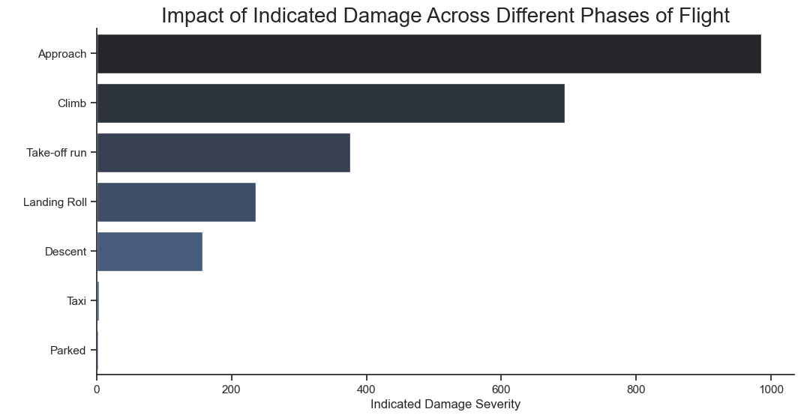
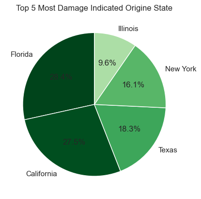
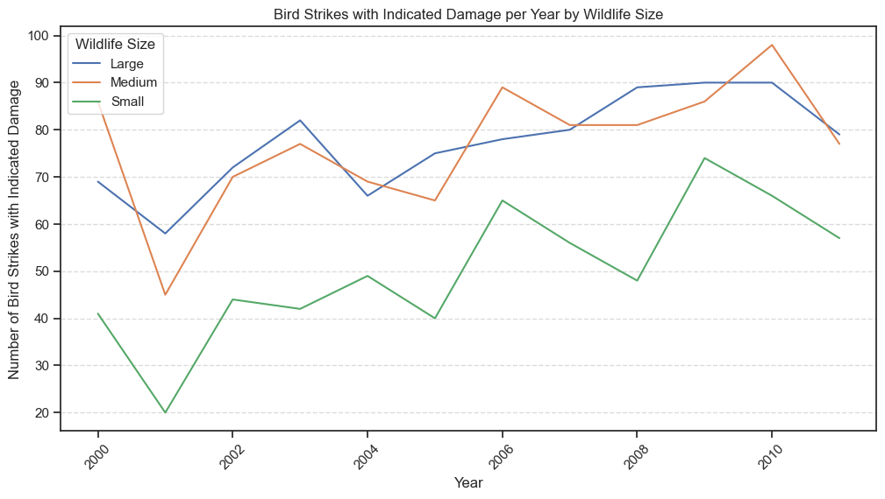

# The Analysis 

## 1. Which types of aircraft are most affected by bird strikes?


To find which types of aircraft are most affected by bird strikes, I focused on the aircraft types and analyzed the damage they incurred. Using the groupby() function, I aggregated the data by aircraft type and calculated the sum of indicated damage for each. This query highlights the types of aircraft and their vulnerability to bird strikes, revealing which aircraft types require more attention regarding bird strike mitigation efforts.

Here's the code I used for this analysis:

```Data.groupby('Aircraft: Type')['Effect: Indicated Damage'].sum()```

This analysis provides insights into the most affected aircraft types, allowing airlines and safety officials to focus on specific models when developing safety measures and preventive strategies.


### Result

The total damage indicated for the incident involving only the airplane is 2,454 


## 2.During which phases of flight do bird strikes occur most frequently?


### Visualize Data

``` python

df_plot = Data.groupby('When: Phase of flight')['Effect: Indicated Damage'].sum().sort_values(ascending= False).reset_index()

plt.figure(figsize=(12, 6))
sns.set_theme(style= 'ticks')
sns.barplot(data=df_plot, y='When: Phase of flight', x='Effect: Indicated Damage', palette= 'dark:b')
sns.despine()

plt.title("Impact of Indicated Damage Across Different Phases of Flight", fontsize = 20)
plt.xlabel('Indicated Damage Severity')
plt.ylabel(' ')
plt.xticks(rotation=0)
#plt.grid(axis='y', linestyle='--', alpha=0.7)

plt.show()

```

### Risults 





*Bar graph visualizing the Different Phases of Flight For
Damage Across in 2000 - 2011.*


### Insights

- **Approach**: Highest damage severity (~1,000). Requires increased vigilance due to risks like bird strikes.
- **Climb**: Significant damage, lower than approach. Caution is needed during ascent.
- **Take-off Run**: Moderate damage (400-600). Emphasizes the importance of pre-flight checks.
- **Landing Roll**: Similar to take-off run. Proper runway management is essential.
- **Descent, Taxi, and Parked**: Lower damage severity, indicating stable operations in these phases.

### Conclusion
The analysis highlights the need for focused safety protocols during approach and climb phases while maintaining vigilance in all phases of flight.


## 3. What are the environmental factors (time of day, location, season) that increase bird strike risks?


### Visualize Data 1

```python ### Top 5 Origine State with Most Damage Indicated

top5_originestate = Data.groupby(['Origin State'])['Effect: Indicated Damage'].sum().sort_values(ascending=False).head(5)

# Create a colormap (e.g., 'Blues') and sort the colors by size (descending)
cmap = plt.get_cmap('Greens')

# Normalize sizes to get corresponding shade intensities (higher = darker)
norm_sizes = np.array(top5_originestate.values) / max(top5_originestate.values)  # Scale values between 0 and 1
colors = cmap(norm_sizes)  # Get shades based on normalized sizes

plt.pie(top5_originestate.values, labels= top5_originestate.index, autopct= '%0.1f%%', colors= colors, startangle=90)

plt.title('Top 5 Most Damage Indicated Origine State')

plt.show()


```

### Risults 




*Pie Chart  visualizing the Top 5 Origine State of Flight For
Damage Across in 2000 - 2011.*

### Insights

- **Florida**: Dominates with 28.4% of incidents, emphasizing the critical need for effective wildlife management strategies.
- **California**: Close second at 27.5%, indicating a significant risk that warrants attention.
- **Texas**: Accounts for 18.3%, reflecting a notable frequency of bird strike events.
- **New York**: Represents 16.1%, highlighting a moderate level of incidents in urban environments.
- **Illinois**: Lowest at 9.6%, still relevant for comprehensive safety assessments.


### Visualize Data 2

``` python 


# Convert 'Effect: Indicated Damage' to integer (True = 1, False = 0)
Data['Effect: Indicated Damage'] = Data['Effect: Indicated Damage'].astype(int)

# Group by 'Year' and 'Altitude bin' and sum the 'Effect: Indicated Damage'
grouped_data = Data.groupby(['Year', 'Wildlife: Size'], as_index=False)['Effect: Indicated Damage'].sum()

# Plot using Seaborn lineplot
plt.figure(figsize=(12, 6))
sns.lineplot(data=grouped_data, x='Year', y='Effect: Indicated Damage', hue='Wildlife: Size')

# Customize the plot
plt.title('Bird Strikes with Indicated Damage per Year by Wildlife Size')
plt.xlabel('Year')
plt.ylabel('')
plt.xticks(rotation=45)
plt.grid(axis='y', linestyle='--', alpha=0.7)
plt.legend(title='Wildlife Size', loc='upper left')

# Display the plot
plt.show()


``` 

### Risults 




*Line Chart  visualizing the Wildlife Size of Flight For
Damage Across in 2000 - 2011.*


### Insights


