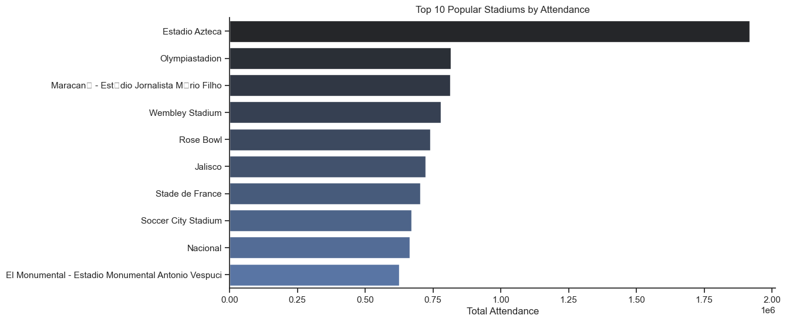

# FIFA World Cup Analysis Project

## Overview

The FIFA World Cup is one of the most celebrated sporting events globally, held every four years and showcasing the pinnacle of football talent from nations around the world. Behind the excitement and passion of the games lies the often-overlooked work of data analysts who provide fans with crucial insights into every match, team, and player. This project seeks to shine a light on these unsung analysts and their contributions, uncovering the data-driven story of the World Cup.

## Project Objectives

Using historical World Cup data, including match results and tournament statistics, this analysis explores key metrics and factors that may influence a World Cup victory. The project combines data from:

1. **WorldCups Dataset** - A historical record of all tournaments, capturing details such as the year, host country, winning team, total goals, teams, and matches played.
2. **WorldCupMatches Dataset** - Information on individual match outcomes, including teams, scores, and match conditions.
3. **WorldCupPlayers Dataset** - Player and lineup details for each match, covering player positions, events, and coaches.

By analyzing these datasets, the project aims to identify patterns, trends, and important factors contributing to success in the World Cup. The findings will offer insights for football fans and highlight the role of data analysts in delivering meaningful answers to fans' questions, adding depth to the narrative of each World Cup.

---


# The Analysis

## 1. Average goals per match

To answer the question, “What is the average number of goals scored per match in the FIFA dataset?” I created a new column called total_goals_per_match based on the existing Home Team Goals and Away Team Goals columns. This column combines the goals scored by both teams in each match, making it easier to analyze the overall goal-scoring trend.

Using the mean of this total_goals_per_match column, I calculated the average number of goals scored per match across all matches in the dataset. This approach highlights the scoring patterns within matches and provides insights into the general level of competitiveness and excitement in World Cup games. By focusing on average goals per match, this analysis can help fans and analysts understand trends in goal-scoring across different tournaments.

This analysis offers a foundational metric for exploring factors that contribute to high-scoring games and can guide future assessments of offensive and defensive strategies employed by teams in the World Cup.


## Visualize Data

``` python


Total_gols_per_match = Data['Away Team Goals'] + Data['Home Team Goals']

Avg_gl_pr_mch = Total_gols_per_match.mean()

result = int(Avg_gl_pr_mch)

print(f'Average Goals Per Match is {result}')


```


## Results

Average Goals Per Match is 2


## Insights

1. Balanced Competition: With an average of 2 goals per match, World Cup games tend to be competitive, reflecting strong defensive and tactical gameplay.

2. Decisive Goals: Each goal holds high value, often being decisive in match outcomes, adding to the suspense and strategic depth of each game.

3. Evolution of Play Styles: This metric allows for comparisons over time, highlighting shifts in offensive and defensive strategies across different tournaments.

4. Strategic Implications: Teams aiming for success may target strategies that allow them to consistently exceed this average, improving their chances in critical matches.


## 2. Home And Away Win Rates

To answer the question, “What are the win rates for home teams, away teams, and draws in FIFA World Cup matches?” I analyzed match outcomes by comparing goals scored by the home and away teams. I categorized each match as a home win, away win, or draw to simplify the analysis.

Using these categories, I calculated the proportion of each outcome across all matches, providing insights into the likelihood of a home or away victory versus a draw. This approach highlights how match location impacts win rates and gives an overview of the balance between home advantage and competition intensity.

This analysis offers a data-driven perspective on match outcomes, helping fans and analysts understand trends in home and away team performance, as well as the frequency of draws. This insight can support further exploration of factors that contribute to home-field advantage or parity in World Cup games.


## Visualize Data

``` python


df = Data[['Home Team Goals','Away Team Goals']]


# Calculate the number of home wins, away wins, and draws
home_wins = (df['Home Team Goals'] > df['Away Team Goals']).sum()
away_wins = (df['Away Team Goals'] > df['Home Team Goals']).sum()
draws = (df['Home Team Goals'] == df['Away Team Goals']).sum()
total_matches = len(df)

# Data for pie chart
labels = ['Home Wins', 'Away Wins', 'Draws']
sizes = [home_wins, away_wins, draws]
colors = ['#4CAF50', '#FF9800', '#03A9F4']  # Custom colors
explode = (0.1, 0.1, 0)  # Explode the Home and Away Wins

# Plotting the pie chart
plt.figure(figsize=(6, 6))
plt.pie(sizes, explode=explode, labels=labels, colors=colors, 
        autopct='%1.1f%%', shadow=True, startangle=140)
plt.title('Home vs Away Win Rates', fontsize = 15)
plt.show()


```


## Results


## Insights

1. Home Advantage: The majority of matches, 57.3%, resulted in home wins, indicating a strong home-field advantage in the FIFA World Cup.

2. Balanced Competition: Away wins account for 20.5% of matches, showing that while home advantage exists, away teams still perform competitively.

3. Draw Frequency: Draws occurred in 22.2% of matches, reflecting a relatively balanced level of competition and parity among teams.


## 3. Attendance Trends

To answer the question, “What are the attendance trends over the years in the FIFA World Cup?” I analyzed the average attendance by year to observe patterns and shifts in spectator engagement over time.

By grouping the data by year and calculating the average attendance for each tournament, I identified how attendance has fluctuated across different World Cups. This approach reveals periods of increased or decreased spectator interest, possibly influenced by factors such as host country, tournament accessibility, and global interest in soccer.

This analysis provides a clear view of how fan engagement has evolved, helping to highlight years with peak attendance and enabling further exploration into what factors might have contributed to those peaks. This insight supports an understanding of the tournament’s growth in popularity and its impact as a global event.


## Visualize Data

``` python 


# Group by year to find average attendance
yearly_attendance = Data.groupby('Year')['Attendance'].mean().reset_index()


# Set plot style without gridlines
sns.set(style="whitegrid", rc={'axes.grid': False})


# Plotting the attendance trend using Seaborn
plt.figure(figsize=(10, 6))
sns.lineplot(data=yearly_attendance, x='Year', y='Attendance', color='b', markers='O')
sns.despine()
sns.set_theme(style= 'ticks')

# Adding labels and title

plt.xlabel('')
plt.ylabel('Average Attendance')
plt.title('Attendance Trend Over Years', fontsize = 15)
plt.grid(True)

# Show the plot
plt.show()


```

## Results


## Insights


1. Upward Trend: Average attendance has generally increased over time, indicating the World Cup's rising global popularity.

2. Notable Peaks: High attendance peaks in certain years (e.g., 1980s) may reflect popular host locations or memorable tournaments.

3. Attendance Fluctuations: Periodic dips suggest influences from factors like location, accessibility, or global economic conditions.

4. Stable Recent Attendance: Recent years show stable attendance, indicating a loyal and consistent fan base.


## 4. Popular Stadiums.

To answer the question, “Which stadiums are the most popular in terms of attendance for FIFA World Cup matches?” I analyzed the total attendance per stadium and identified the top stadiums that attracted the largest crowds.

By grouping the data by stadium and summing up attendance, I could determine which stadiums had the highest total attendance over time. Additionally, I counted the number of matches played at each stadium to provide further context on match frequency and its influence on overall attendance.

This analysis highlights the stadiums with the most significant spectator draw, providing insights into popular venues and their role in hosting high-attendance matches. These findings can support event organizers in selecting stadiums with proven attendance appeal for future tournaments, ultimately enhancing fan engagement and event atmosphere.

## Visualize Data

``` python


# Group by stadium name and sum the attendance
stadium_attendance = Data.groupby('Stadium')['Attendance'].sum().reset_index()

# Sort by attendance in descending order
popular_stadiums = stadium_attendance.sort_values(by='Attendance', ascending=False)

# Display the top stadiums
popular_stadiums.head(10)

# Count matches played at each stadium
stadium_match_count = Data.groupby('Stadium')['Datetime'].count().reset_index()
stadium_match_count.rename(columns={'Datetime': 'match_count'}, inplace=True)

# Merge with attendance data
popular_stadiums = popular_stadiums.merge(stadium_match_count, on='Stadium')

# Sort by attendance
popular_stadiums = popular_stadiums.sort_values(by='Attendance', ascending=False)

popular_stadiums.head(10)

# Set the size of the plot
plt.figure(figsize=(12, 6))


# Create a bar plot for the top stadiums
sns.set_theme(style='ticks')
sns.barplot(data=popular_stadiums.head(10), x='Attendance', y='Stadium', palette= 'dark:b')
sns.despine()
plt.title('Top 10 Popular Stadiums by Attendance')
plt.xlabel('Total Attendance')
plt.ylabel('')
plt.show()


```


## Results



## Insights

1. Top Stadium: Estadio Azteca stands out with the highest total attendance, indicating its significant popularity for hosting high-attendance matches.

2. Global Spread: The top 10 stadiums represent various countries, showcasing the international appeal and diverse locations of popular World Cup venues.

3. Consistent High Attendance: Stadiums like Olympiastadion, Maracanã, and Wembley Stadium have consistently attracted large crowds, emphasizing their status as iconic venues.

4. Historical Importance: Many of these stadiums, such as Rose Bowl and Stade de France, have hosted memorable World Cup matches, contributing to their popularity and high attendance numbers.

5. Audience Capacity Impact: Larger stadiums with higher seating capacities naturally attract more fans, influencing their ranking in total attendance.


## 5. High-Scoring Teams


## Visualize Data

``` python 


### home teams total goals
home_goals = Data.groupby('Home Team Name')['Home Team Goals'].sum().reset_index()

### away team total goals
away_goals = Data.groupby('Away Team Name')['Away Team Goals'].sum().reset_index()

# Rename columns for merging
home_goals.rename(columns={'Home Team Name': 'team', 'Home Team Goals': 'total_goals'}, inplace=True)
away_goals.rename(columns={'Away Team Name': 'team', 'Away Team Goals': 'total_goals'}, inplace=True)

### concat home and away 
team_goals = pd.concat([home_goals,away_goals])

### group by sum total goals by team name
team_goals = team_goals.groupby('team')['total_goals'].sum().reset_index()

# Sort teams by total goals in descending order
heigh_scoring_teams = team_goals.sort_values(by= 'total_goals', ascending= False).head(10)

heigh_scoring_teams


```


## Results

<div>
<style scoped>
    .dataframe tbody tr th:only-of-type {
        vertical-align: middle;
    }

    .dataframe tbody tr th {
        vertical-align: top;
    }

    .dataframe thead th {
        text-align: right;
    }
</style>
<table border="1" class="dataframe">
  <thead>
    <tr style="text-align: right;">
      <th></th>
      <th>team</th>
      <th>total_goals</th>
    </tr>
  </thead>
  <tbody>
    <tr>
      <th>7</th>
      <td>Brazil</td>
      <td>221.0</td>
    </tr>
    <tr>
      <th>2</th>
      <td>Argentina</td>
      <td>131.0</td>
    </tr>
    <tr>
      <th>29</th>
      <td>Germany FR</td>
      <td>131.0</td>
    </tr>
    <tr>
      <th>39</th>
      <td>Italy</td>
      <td>128.0</td>
    </tr>
    <tr>
      <th>26</th>
      <td>France</td>
      <td>106.0</td>
    </tr>
    <tr>
      <th>28</th>
      <td>Germany</td>
      <td>93.0</td>
    </tr>
    <tr>
      <th>66</th>
      <td>Spain</td>
      <td>92.0</td>
    </tr>
    <tr>
      <th>34</th>
      <td>Hungary</td>
      <td>87.0</td>
    </tr>
    <tr>
      <th>47</th>
      <td>Netherlands</td>
      <td>86.0</td>
    </tr>
    <tr>
      <th>74</th>
      <td>Uruguay</td>
      <td>80.0</td>
    </tr>
  </tbody>
</table>
</div>


## Insights

1. Top Scorer: Brazil leads with a remarkable 221 total goals, highlighting their offensive strength and consistency in World Cup history.

2. Close Competition: Argentina and Germany (including Germany FR) are close contenders with 131 goals each, underscoring their competitive performance in World Cups.

3. European Dominance: European teams like Germany, Italy, France, and Spain are prominent on the list, reflecting Europe’s strong presence in high-scoring World Cup matches.

4. South American Powerhouses: Brazil, Argentina, and Uruguay showcase South America’s football talent, collectively contributing a significant portion of World Cup goals.

5. Historic Teams: Traditional teams like Hungary, despite fewer recent appearances, still hold a place among the top 10 in total goals, pointing to their historic impact on the tournament.


## 6. Frequent Matchups


## Visualize Data

``` python 


# Sort teams alphabetically within each row to ensure unique representation of matchups
Data['matchup'] = Data.apply(lambda row: '-'.join(sorted([row['Home Team Name'], row['Away Team Name']])), axis=1)

# Count each matchup occurrence
matchup_count = Data['matchup'].value_counts().reset_index()
matchup_count.columns = ['matchup', 'count']
matchup_count = matchup_count.sort_values(by= 'count', ascending= False).head(10)
matchup_count


```

## Results

<div>
<style scoped>
    .dataframe tbody tr th:only-of-type {
        vertical-align: middle;
    }

    .dataframe tbody tr th {
        vertical-align: top;
    }

    .dataframe thead th {
        text-align: right;
    }
</style>
<table border="1" class="dataframe">
  <thead>
    <tr style="text-align: right;">
      <th></th>
      <th>matchup</th>
      <th>count</th>
    </tr>
  </thead>
  <tbody>
    <tr>
      <th>0</th>
      <td>Brazil-Sweden</td>
      <td>7</td>
    </tr>
    <tr>
      <th>6</th>
      <td>Argentina-Netherlands</td>
      <td>5</td>
    </tr>
    <tr>
      <th>9</th>
      <td>Argentina-England</td>
      <td>5</td>
    </tr>
    <tr>
      <th>8</th>
      <td>Brazil-Netherlands</td>
      <td>5</td>
    </tr>
    <tr>
      <th>7</th>
      <td>Brazil-Spain</td>
      <td>5</td>
    </tr>
    <tr>
      <th>1</th>
      <td>Brazil-Czechoslovakia</td>
      <td>5</td>
    </tr>
    <tr>
      <th>5</th>
      <td>Argentina-Italy</td>
      <td>5</td>
    </tr>
    <tr>
      <th>3</th>
      <td>Brazil-Italy</td>
      <td>5</td>
    </tr>
    <tr>
      <th>2</th>
      <td>France-Italy</td>
      <td>5</td>
    </tr>
    <tr>
      <th>4</th>
      <td>Germany FR-Yugoslavia</td>
      <td>5</td>
    </tr>
  </tbody>
</table>
</div>


## Insights


<ul>
    <li><strong>Most Frequent Matchup</strong>: Brazil vs. Sweden is the most frequent matchup in World Cup history, with these teams meeting <strong>7 times</strong>, highlighting a notable rivalry.</li><br>
    <li><strong>Consistent South American-European Rivalries</strong>: Matchups like Brazil vs. Netherlands, Argentina vs. Netherlands, and Brazil vs. Spain have each occurred <strong>5 times</strong>, showcasing recurring clashes between South American and European football powerhouses.</li><br>
    <li><strong>Historic Clashes</strong>: Argentina has met England <strong>5 times</strong> in the World Cup, a rivalry with historical and competitive significance that often attracts global attention.</li><br>
    <li><strong>Italy’s Strong Presence</strong>: Italy appears in several frequent matchups (against Argentina, Brazil, and France), emphasizing their long-standing impact in World Cup tournaments.</li><br>
    <li><strong>Recurring European Encounters</strong>: The matchup between Germany FR and Yugoslavia, with <strong>5 meetings</strong>, reflects strong competition among European teams in World Cup history.</li>
</ul>


## 7.Performance By Stages

##  Visualize Data

``` python


## find total goals per match
Data['Match_goals'] = Data['Away Team Goals'] + Data['Home Team Goals']

## Group by total goals by stages
stage_performance = Data.groupby('Stage')['Match_goals'].sum().reset_index()

### indentify each stages total matches
stage_performance['No_Match'] = Data.groupby('Stage')['Datetime'].count().values

## create a new feature average goal per match in each stages
stage_performance['Avg_match_goal'] = stage_performance['Match_goals'] / stage_performance['No_Match']
stage_performance['Avg_match_goal'] = stage_performance['Avg_match_goal'].astype(int)
stage_performance


```


## Results


<div>
<style scoped>
    .dataframe tbody tr th:only-of-type {
        vertical-align: middle;
    }

    .dataframe tbody tr th {
        vertical-align: top;
    }

    .dataframe thead th {
        text-align: right;
    }
</style>
<table border="1" class="dataframe">
  <thead>
    <tr style="text-align: right;">
      <th></th>
      <th>Stage</th>
      <th>Match_goals</th>
      <th>No_Match</th>
      <th>Avg_match_goal</th>
    </tr>
  </thead>
  <tbody>
    <tr>
      <th>0</th>
      <td>Group 1</td>
      <td>174.0</td>
      <td>62</td>
      <td>2</td>
    </tr>
    <tr>
      <th>1</th>
      <td>Group 4</td>
      <td>176.0</td>
      <td>55</td>
      <td>3</td>
    </tr>
    <tr>
      <th>2</th>
      <td>Group 2</td>
      <td>187.0</td>
      <td>59</td>
      <td>3</td>
    </tr>
    <tr>
      <th>3</th>
      <td>Group 3</td>
      <td>154.0</td>
      <td>56</td>
      <td>2</td>
    </tr>
    <tr>
      <th>4</th>
      <td>Semi-finals</td>
      <td>123.0</td>
      <td>34</td>
      <td>3</td>
    </tr>
    <tr>
      <th>5</th>
      <td>Final</td>
      <td>68.0</td>
      <td>19</td>
      <td>3</td>
    </tr>
    <tr>
      <th>6</th>
      <td>Preliminary round</td>
      <td>43.0</td>
      <td>8</td>
      <td>5</td>
    </tr>
    <tr>
      <th>7</th>
      <td>Quarter-finals</td>
      <td>175.0</td>
      <td>62</td>
      <td>2</td>
    </tr>
    <tr>
      <th>8</th>
      <td>Match for third place</td>
      <td>59.0</td>
      <td>15</td>
      <td>3</td>
    </tr>
    <tr>
      <th>9</th>
      <td>First round</td>
      <td>44.0</td>
      <td>9</td>
      <td>4</td>
    </tr>
    <tr>
      <th>10</th>
      <td>Group 6</td>
      <td>57.0</td>
      <td>12</td>
      <td>4</td>
    </tr>
    <tr>
      <th>11</th>
      <td>Group B</td>
      <td>169.0</td>
      <td>60</td>
      <td>2</td>
    </tr>
    <tr>
      <th>12</th>
      <td>Group A</td>
      <td>160.0</td>
      <td>60</td>
      <td>2</td>
    </tr>
    <tr>
      <th>13</th>
      <td>Group 5</td>
      <td>9.0</td>
      <td>6</td>
      <td>1</td>
    </tr>
    <tr>
      <th>14</th>
      <td>Group C</td>
      <td>126.0</td>
      <td>48</td>
      <td>2</td>
    </tr>
    <tr>
      <th>15</th>
      <td>Group D</td>
      <td>123.0</td>
      <td>48</td>
      <td>2</td>
    </tr>
    <tr>
      <th>16</th>
      <td>Group F</td>
      <td>93.0</td>
      <td>48</td>
      <td>1</td>
    </tr>
    <tr>
      <th>17</th>
      <td>Group E</td>
      <td>121.0</td>
      <td>48</td>
      <td>2</td>
    </tr>
    <tr>
      <th>18</th>
      <td>Round of 16</td>
      <td>164.0</td>
      <td>64</td>
      <td>2</td>
    </tr>
    <tr>
      <th>19</th>
      <td>Group H</td>
      <td>72.0</td>
      <td>30</td>
      <td>2</td>
    </tr>
    <tr>
      <th>20</th>
      <td>Group G</td>
      <td>70.0</td>
      <td>30</td>
      <td>2</td>
    </tr>
    <tr>
      <th>21</th>
      <td>Third place</td>
      <td>9.0</td>
      <td>2</td>
      <td>4</td>
    </tr>
    <tr>
      <th>22</th>
      <td>Play-off for third place</td>
      <td>3.0</td>
      <td>1</td>
      <td>3</td>
    </tr>
  </tbody>
</table>
</div>


## Insights

* High-Scoring Stages:

The preliminary round has the highest average match goals with an impressive 5 goals per match, indicating intense offensive play during initial rounds.
The first round and third place matches also have relatively high average goals, with 4 goals per match, suggesting a more relaxed or high-stakes scenario where teams may focus on scoring.
Group Stage Variability:

* Different group stages show variation in total match goals and average goals per match:
Group 2 has the highest total goals at 187 over 59 matches with an average of 3 goals per match, making it one of the most goal-heavy group stages.
Group 1 and Group 3 both average 2 goals per match, reflecting lower-scoring dynamics compared to other groups.
Knockout Stages:

* Semi-finals have a total of 123 goals over 34 matches, averaging 3 goals per match, showing a competitive balance between offense and defense at this high-stakes stage.
The Final stage also maintains an average of 3 goals per match across 19 games, indicating a high level of intensity even at the last, most critical game of the tournament.
Round of 16 Consistency:

* The Round of 16 stage has a substantial number of matches (64) with a total of 164 goals and an average of 2 goals per match, representing a balanced scoring trend as teams advance to the knockout phase.
Goals by Match Type:

* Matches that determine third place (such as "Match for third place" and "Play-off for third place") show variable goal-scoring patterns, with an average of 3-4 goals per match, indicating relatively higher scoring compared to other high-stakes knockout games, likely due to lower defensive pressure.
Defensive Group Performance:

* Groups F and G have notably low average goals per match, with 1 goal per match in Group F and 2 goals per match in Group G, showing a more defense-oriented or evenly matched competition.


## 8. Analyze “Win conditions” for patterns


## Visualize Data

``` python


# Replace values using regex to categorize into 'extra time' and 'penalties'
df = Data.copy()
df['win_condition'] = df['Win conditions'].replace(
    {
        r'.*win after extra time.*': 'extra time',
        r'.*win on penalties.*': 'penalties'
    },
    regex=True
)
df = df['win_condition'].value_counts()


plt.pie(df.values, labels= df.index, autopct= '%0.1f%%')
plt.show()


```


## Results


## Insights

<ul>
        <li><strong>Majority of Wins in Regular Time:</strong> 93.2% of matches were won within the regular game time, showing that most games don’t require extra time or penalties to determine a winner.</li><br>
        <li><strong>Extra Time Wins:</strong> About 3.3% of the matches went into extra time, indicating a smaller but notable portion of games that needed additional time beyond regular play.</li><br>
        <li><strong>Golden Goal and Penalty Wins:</strong> Wins that came from Golden Goals or penalties are rare. Specifically, 3.1% of wins were through penalties, while only 0.4% were through Golden Goal penalties.</li><br>
        <li><strong>Low Dependency on Penalties:</strong> With penalties accounting for just a small percentage (3.1%) of the wins, it suggests that most games are decided by regular gameplay, either in the standard or extra time.</li>
 </ul>


## 9. Status To Understand Starting Players vs Substitutes.

## Visualize Data

``` python


### find players percentage by line up using pie plot 
plt.figure(figsize=(8, 6))
plt.pie(Data['Line-up'].value_counts().values, labels= Data['Line-up'].value_counts().index, autopct= '%0.2f%%',startangle=120)
plt.title('Distribution of Starting Players vs. Substitutes', fontsize = 15 )
plt.show()

```

## Results


## Insights

1.	Nearly Equal Distribution: The chart shows an almost equal split between starting players (“N”) and substitutes (“S”), with starting players making up 50.36% and substitutes 49.64%.

2.	Minimal Difference: The difference between starting players and substitutes is minimal, less than 1%, indicating balanced usage of both types of players in matches.
3.	Strategic Flexibility: This near-equal distribution suggests that teams often rely on substitutes nearly as much as starting players, possibly for strategic flexibility during matches.


## 10. Identify impactful players by analyzing match events and goals.

## Visualize Data

``` python


### create a variable top_10_soorer 
top_10_scorer = Data['Player Name'].value_counts().sort_values(ascending= False).reset_index().head(10)
##Rename column name
top_10_scorer.columns = ['Player Name', 'tot_goals']

### Plot visualization

sns.barplot(data= top_10_scorer, x = 'tot_goals', y = 'Player Name')
plt.title('Top 10 Goal Scorers')
plt.ylabel('')
plt.xlabel('Total Goals')
plt.show()

```


## Results


## Insights


1.	Ronaldo as Top Scorer: Ronaldo has the highest number of goals, leading significantly over others.

2.	Klose in Second Place: Klose follows Ronaldo but with a noticeable gap, showing Ronaldo’s unmatched scoring record.

3.	Close Scoring Range: The remaining players (Cafu, Dida, Sepp Maier, Leao, Oscar, Müller, Wladyslaw Zmuda, and Silva) have similar goal counts, indicating strong competition among them.

4.	Consistency Among Top Players: The close range in goal counts (except for Ronaldo) shows high consistency among top scorers.


11. Analyze coach impact by examining teams’ performances under different coaches.


## Visualize Data

``` python


# Create a helper column for match result (win/loss/draw) for each team
df = Data.copy()
df['home_team_win'] = df['Home Team Goals'] > df['Away Team Goals']
df['away_team_win'] = df['Away Team Goals'] > df['Home Team Goals']
df['draw'] = df['Home Team Goals'] == df['Away Team Goals']

# Home team data
home_data = df[['Coach Name', 'Home Team Name', 'Home Team Goals', 'Away Team Goals', 'home_team_win', 'draw', 'Year']].copy()
home_data['team'] = home_data['Home Team Name']
home_data['goals_scored'] = home_data['Home Team Goals']
home_data['goals_conceded'] = home_data['Away Team Goals']
home_data['win'] = home_data['home_team_win']

# Away team data
away_data = df[['Coach Name', 'Away Team Name', 'Away Team Goals', 'Home Team Goals', 'away_team_win', 'draw', 'Year']].copy()
away_data['team'] = away_data['Away Team Name']
away_data['goals_scored'] = away_data['Away Team Goals']
away_data['goals_conceded'] = away_data['Home Team Goals']
away_data['win'] = away_data['away_team_win']

# Combine both dataframes
team_performance = pd.concat([home_data, away_data])

# Aggregate performance metrics for each coach
coach_performance = team_performance.groupby(['Coach Name', 'team']).agg(
    win_rate=('win', 'mean'),  # Percentage of wins
    avg_goals_scored=('goals_scored', 'mean'),
    avg_goals_conceded=('goals_conceded', 'mean'),
    total_matches=('win', 'count')
).reset_index()
coach_performance['avg_goals_scored'] = coach_performance['avg_goals_scored'].astype(int)
# Convert win rate to percentage
coach_performance['win_rate'] = coach_performance['win_rate'] * 100

coach_performance = coach_performance[coach_performance['total_matches'] > 5]  # Example threshold

coach_performance = coach_performance[coach_performance['win_rate'] == 100].sort_values(by = 'avg_goals_scored', ascending= False).head(10)

top_coaches = coach_performance.sort_values(by='win_rate', ascending=False).head(10)

plt.figure(figsize=(10, 6))
sns.barplot(data=top_coaches, x='avg_goals_scored', y='Coach Name', palette= 'dark:b')
plt.title('Top 10 Coaches With Win Rate(100%) And Avg Goals Per Match')
plt.xlabel('Win Rate (%)')
plt.ylabel('')
plt.show()


```

## Results 


## Insights


