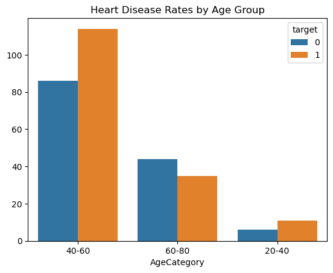
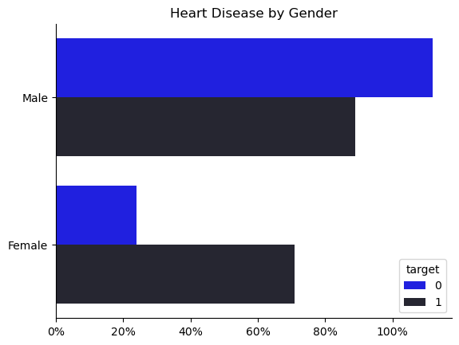
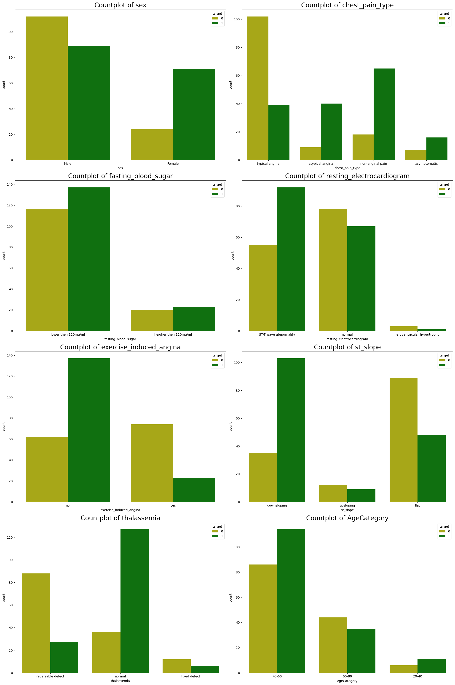

# Overview
This project aims to analyze health and medical data related to heart disease. With the increasing importance of preventive healthcare, it is essential to extract insights from historical heart disease data for better future preparedness. This analysis focuses on exploring key metrics such as heart disease prevalence by gender, age, and other contributing factors. It also utilizes ETL (Extract, Transform, and Load) processes and Exploratory Data Analysis (EDA) to uncover meaningful relationships between different attributes.


# The Analysis

## 1. What are the heart disease rates across different age groups?

To answer the question, “What are the heart disease rates across different age groups?” I created a new column called age_category based on the existing age column. This column groups ages into categories (20-40, 40-60, 60-80) to simplify analysis.

Using the groupby() function, I aggregated the data by age_category and calculated the proportion of heart disease cases within each group. This approach highlights how heart disease rates vary across age categories, providing insights into which age groups are more affected. By focusing on age-related risk, this analysis can support targeted health interventions for age-specific groups that are at higher risk.

This analysis offers a data-driven foundation for identifying at-risk age groups and guiding public health strategies tailored to age-based needs in heart disease prevention and treatment efforts.


### Visualize Data 

``` python 

Data['AgeCategory'] = pd.cut(Data['age'], bins=[20, 40, 60, 80], labels=['20-40', '40-60', '60-80'])

sns.countplot(data=Data, x='AgeCategory', hue='target')

plt.title('Heart Disease Rates by Age Group')
plt.ylabel('')
plt.show()

```

### Results 



### Insights


#### 📊 Visualization Insights

- **Age 40-60**:  
  - Highest heart disease prevalence, with cases of diseased individuals surpassing healthy ones.
  - Indicates a critical age group for preventive interventions.

- **Age 60-80**:  
  - Heart disease cases remain significant, though healthier individuals slightly outnumber the diseased.
  - Continued monitoring and medical support are essential for this group.

- **Age 20-40**:  
  - Minimal heart disease cases, suggesting younger adults have a lower risk.
  - Focus can remain on maintaining healthy lifestyle habits to prevent future risks.

#### 🛠️ Conclusion

- **Risk Trend**:  
  - Heart disease prevalence increases with age, peaking in the 40-60 range, followed by a slight decline in older age groups.

- **Preventive Focus**:  
  - Middle-aged adults (40-60) are the most at risk and should be the primary target for health interventions.


## 2. How does the prevalence of heart disease differ between men and women?


### Visualize Data 

``` python

sns.countplot(data=Data, y='sex', hue='target', palette= 'dark:b_r')

from matplotlib.ticker import PercentFormatter

ax = plt.gca()
ax.xaxis.set_major_formatter(PercentFormatter(decimals= 0))

sns.despine()
plt.ylabel('')
plt.xlabel('')
plt.title('Heart Disease by Gender')

plt.show()


```

### Results 




### Insights

#### 📊 Visualization Insights

- **Males**:
  - **Higher Risk**: Males have a higher prevalence of heart disease compared to females.
  - A significant portion is affected, although healthy individuals are also represented in large numbers.

- **Females**:
  - **Lower Risk**: Fewer cases of heart disease compared to males.
  - The majority of females are heart disease-free, indicating better health outcomes overall.

- **Gender Risk Comparison**:
  - Males exhibit greater vulnerability to heart disease, suggesting a need for more focused interventions.
  - Although females have fewer cases, continuous monitoring is essential to detect any future trends or emerging risks.

#### 🛠️ Conclusion

- **Preventive Focus**:
  - Health programs should prioritize heart disease prevention in males, while also maintaining preventive care for females to sustain their lower risk.


## 3. Which attributes (e.g., cholesterol, blood pressure) correlate most strongly with heart disease?


### Visualize Data 

``` python


fig, axes = plt.subplots(2, 4, figsize=(24, 10))  
axes = axes.flatten()

for i, feature in enumerate(cat_features):
    sns.countplot(x=feature, hue='target', data=Data, ax=axes[i],  palette=['g','r'])
    axes[i].set_title(f'Countplot of {feature}', fontsize = 15)  
    
plt.tight_layout()
plt.show()


``` 


### Results 




### Insights


####  📊 Visualization Insights

- **Gender and Heart Disease**:
  - Males show a higher count of heart disease cases compared to females, indicating a higher risk among men in this dataset.

- **Chest Pain Type**:
  - Patients experiencing atypical angina and non-anginal pain have higher counts of heart disease cases, suggesting that these chest pain types may correlate with heart issues.

- **Fasting Blood Sugar**:
  - Individuals with fasting blood sugar levels below 120 mg/dl are more frequently affected by heart disease, implying that fasting blood sugar alone may not be a significant predictor in this dataset.

- **Resting Electrocardiogram**:
  - ST-T wave abnormalities show a strong association with heart disease cases, highlighting its importance in predicting heart disease.

- **Exercise-Induced Angina**:
  - Heart disease is more common among patients without exercise-induced angina, suggesting a potential inverse relationship with exercise tolerance.

- **ST Slope**:
  - A flat ST slope is linked with higher heart disease counts, indicating this feature might be a risk indicator.

- **Thalassemia**:
  - Patients with a reversible defect in thalassemia show a higher frequency of heart disease, suggesting a possible link with this condition.

- **Age Category**:
  - The 40-60 age group has the highest count of heart disease cases, pointing to an increased risk in middle-aged individuals within the dataset.

#### 🛠️ Conclusion
These insights can guide public health strategies and preventative measures by highlighting demographic and clinical factors most associated with heart disease. Focusing on at-risk groups, such as middle-aged individuals and those with specific health indicators, may improve heart disease prevention efforts.


## 5. Are there any specific factors that increase heart disease risk significantly?

### 🔍 Key Findings

### 🔑 Most Important Risk Factors:
- **📅 Age**: Risk increases significantly in the 40-60 age group.
- **👨 Gender**: Men have a higher heart disease rate than women.
- **💔 Chest Pain Type**: Atypical and non-anginal pain types are associated with higher heart disease risk.
- **📉 ECG Abnormalities**: ST-T wave abnormalities are strong indicators of heart disease risk.

### 📊 Visual Insights:
Each of these factors was visualized to identify trends and correlations. The patterns provide a foundation for understanding which demographics and health indicators are most at risk.

## 🌐 Preventive Healthcare Recommendations
- **Targeted Screening**: Focus on high-risk groups (men, middle-aged individuals).
- **Lifestyle Programs**: Promote exercise, diet, and regular check-ups for early detection.
- **Educational Outreach**: Educate on atypical chest pain and the importance of ECG tests.


